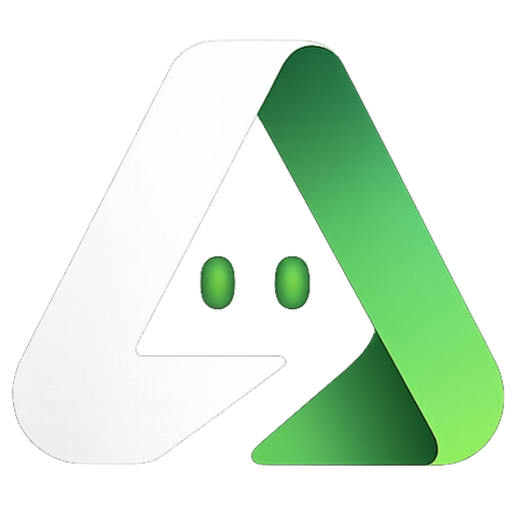
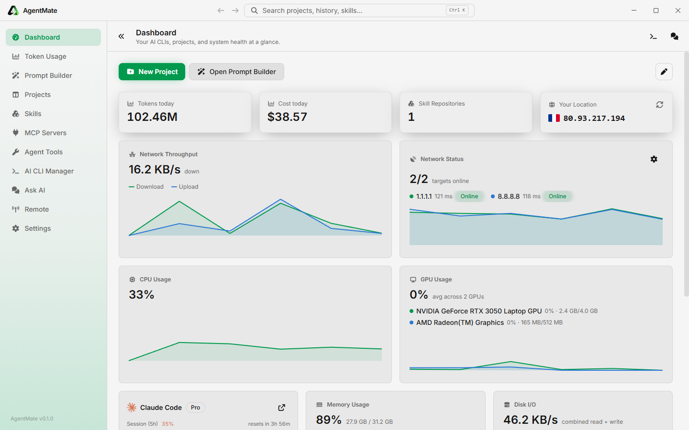
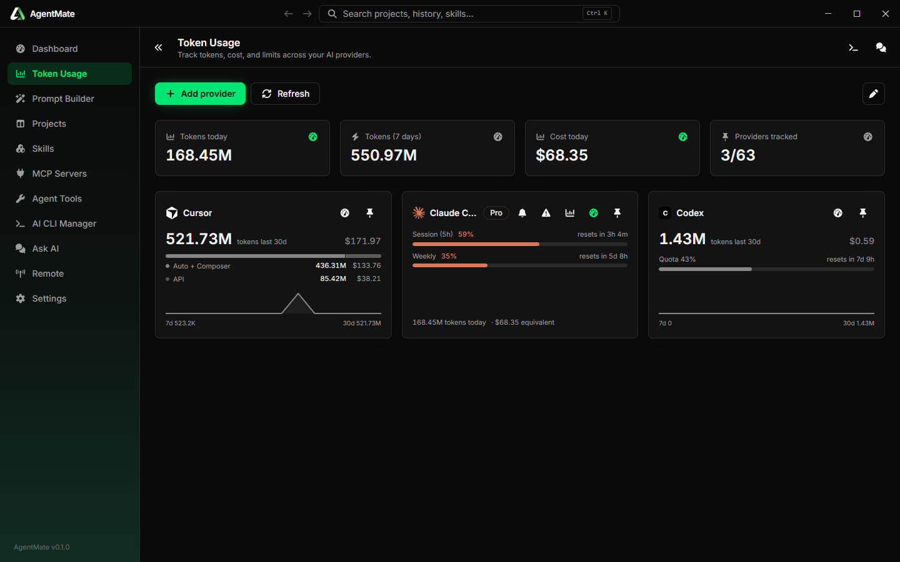
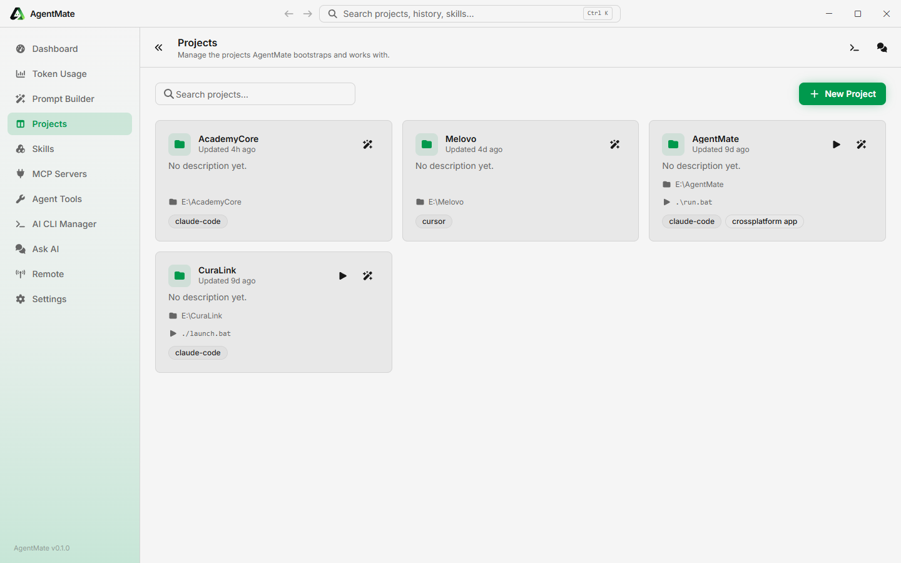
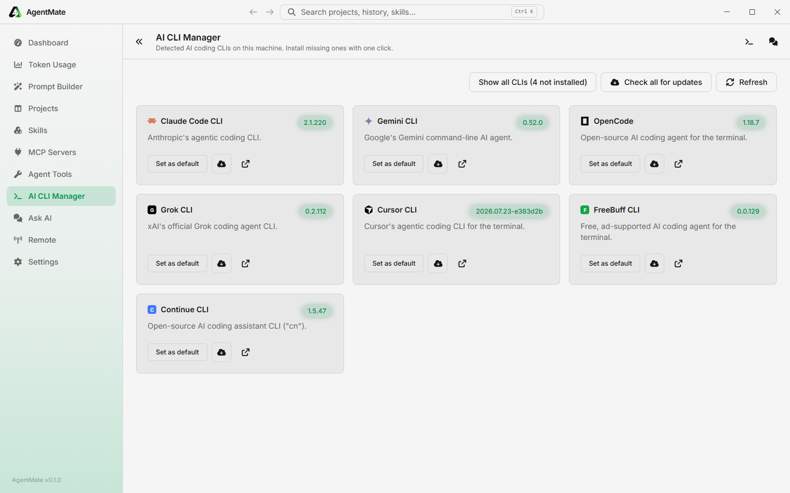

<div align="center">
  

  # AgentMate

  **A control center for your AI coding agents.**

  Manage every AI coding CLI on your machine (Claude Code, Codex, Cursor, Gemini, Grok, OpenCode, and more) from one desktop app: track token usage and cost, bootstrap and launch projects, review diffs, watch GitHub Actions, build and translate prompts, install skills and MCP servers, and remote-control another AgentMate over your local network.

  
  
  
  [](LICENSE)
</div>

---

## Screenshots

<table>
  <tr>
    <td width="50%"></td>
    <td width="50%"></td>
  </tr>
  <tr>
    <td align="center"><em>Dashboard: CLIs, GitHub, usage, and system health</em></td>
    <td align="center"><em>Token Usage: tokens, cost, quotas, and desktop widgets</em></td>
  </tr>
  <tr>
    <td width="50%"></td>
    <td width="50%"></td>
  </tr>
  <tr>
    <td align="center"><em>Projects: git, reviews, packages, notes, and run commands</em></td>
    <td align="center"><em>AI CLI Manager: detect, install, and update coding CLIs</em></td>
  </tr>
</table>

## Features

- **Dashboard**: CLIs, usage, GitHub activity, GitHub Actions, and system health (CPU, GPU, memory, network) at a glance. Rearrange the cards, and see which apps are using the most resources.
- **Token Usage**: track tokens, cost, and rate-limit quotas across 60+ providers. Local-log scanning for Claude Code and Codex (no API key needed). Combined all-agents charts, plus floating glass desktop widgets you can resize, restyle, and pin always on top.
- **Projects**: bootstrap a repo, keep notes, run git (status, branches, tags, GitHub Actions), update packages (npm, pnpm, Yarn, NuGet), schedule prompts, and attach skills, MCP servers, and hooks. Launch each project's run command from its card. Multi-agent code review with Diffray (bugs, security, performance, consistency) using Claude Code, Cursor Agent, OpenCode, or Codex.
- **Notifications**: GitHub Actions failures from the repos you connected, in one list.
- **AI CLI Manager**: detects every AI coding CLI installed on the machine and installs or updates missing ones with one click (Claude Code, Gemini, OpenCode, Codex, Grok, Cursor, Qwen, Aider, Goose, Cline, Continue, and more).
- **Prompt Builder**: describe what you want, and AgentMate structures it into a prompt for the agent of your choice. Generate, translate, and copy from the keyboard.
- **Prompt History**: every prompt you've generated or translated, searchable, with tags and proper Persian / RTL rendering.
- **Skill Marketplace**: install agent skills from configurable repositories or skills.sh, including into a project's agent folders.
- **MCP Marketplace**: install MCP servers into a project from configurable repositories.
- **Agent Tools**: curated third-party tools that cut agent token spend or improve code quality, including Diffray.
- **Ask AI**: a persistent assistant conversation, one keystroke away.
- **Remote**: control another AgentMate over your local network, AnyDesk-style, over WebSockets, including from the companion mobile app.
- **AI Pet**: an optional desktop companion. Click it for a token report, drag it around, and let it tell you when a pipeline fails or the network drops. Built-in characters, or add your own GIF / PNG / WebP.
- **Settings**: tabbed General, AI Pet, AI, Notifications, and Data (backup / restore and app updates from GitHub Releases).
- **Also in the app**: a command palette (Ctrl+K / Cmd+K), a tabbed terminal drawer (Ctrl+backtick), and a searchable history of toasts.

## Tech stack

| Layer | Stack |
|---|---|
| Desktop app | Electron, React 19, TypeScript 7, Vite (`electron-vite`), Tailwind CSS, Radix UI, TanStack Query |
| Mobile companion | Expo / React Native, WebRTC |
| Shared packages | `@agentmat/core` (business logic), `@agentmat/protocol` (shared types/wire protocol) |
| Local storage | better-sqlite3 |
| Terminal | node-pty + xterm.js |
| Updates | electron-updater (GitHub Releases) |
| Tooling | pnpm workspaces, Biome |

## Project structure

```
AgentMate/
├── apps/
│   ├── desktop/     Electron app (main, preload, renderer), the primary product
│   └── mobile/      Expo/React Native companion app for the Remote feature
├── packages/
│   ├── core/        Shared business logic (@agentmat/core)
│   └── protocol/    Shared types and wire protocol (@agentmat/protocol)
└── patches/         pnpm patches for third-party packages
```

## Getting started

**Prerequisites:** Node.js ≥ 20, [pnpm](https://pnpm.io) ≥ 11.

Installers for Windows, macOS, and Linux are published on [GitHub Releases](https://github.com/Cyrus-Sushiant/AgentMate/releases). The app can also check that feed and install an update from Settings.

```bash
pnpm install

# Build the shared packages and launch the desktop app in dev mode
pnpm dev
```

On Windows you can also just run `run.bat`, which installs dependencies, verifies the Electron binary, and starts the app.

### Common scripts (from the repo root)

| Command | What it does |
|---|---|
| `pnpm dev` | Build `core`/`protocol`, then launch the desktop app in dev mode with hot reload |
| `pnpm build` | Build `core`, `protocol`, and the desktop app's production bundle |
| `pnpm package` | Package the desktop app into installers via `electron-builder` |
| `pnpm mobile` | Build `protocol`, then launch the Expo dev server for the mobile companion app |
| `pnpm typecheck` | Type-check every workspace package |
| `pnpm lint` | Lint every workspace package |

## License

[MIT](LICENSE) © SmartClouds
