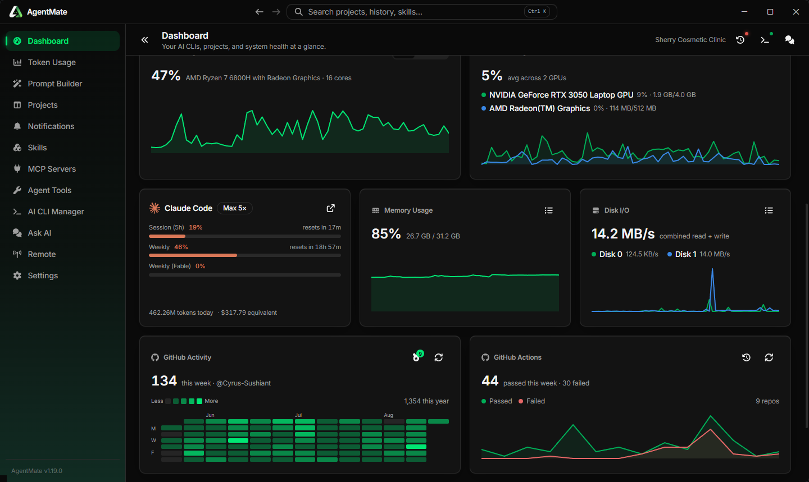
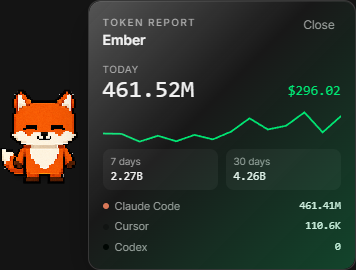

<div align="center">
  

  # AgentMate

  **A control center for your AI coding agents.**

  Manage every AI coding CLI on your machine (Claude Code, Codex, Cursor, Gemini, Grok, OpenCode, and more) from one desktop app: track token usage and cost, bootstrap and launch projects, review diffs, watch GitHub Actions, build and translate prompts, install skills and MCP servers, and remote-control another AgentMate over your local network.

  
  
  
  [](LICENSE)
</div>

---

## Screenshots

<table>
  <tr>
    <td width="50%"></td>
    <td width="50%"></td>
  </tr>
  <tr>
    <td align="center"><em>Dashboard: CLIs, GitHub, usage, and system health</em></td>
    <td align="center"><em>Token Usage: tokens, cost, quotas, and desktop widgets</em></td>
  </tr>
  <tr>
    <td width="50%"></td>
    <td width="50%"></td>
  </tr>
  <tr>
    <td align="center"><em>Projects: git, reviews, packages, notes, and run commands</em></td>
    <td align="center"><em>AI CLI Manager: detect, install, and update coding CLIs</em></td>
  </tr>
  <tr>
    <td width="50%"></td>
    <td width="50%" align="center"></td>
  </tr>
  <tr>
    <td align="center"><em>Quotas, system health, GitHub activity, and Actions</em></td>
    <td align="center"><em>AI Pet: click the companion for a token report</em></td>
  </tr>
</table>

## Features

- **Dashboard**: CLIs, usage, GitHub activity, GitHub Actions, and system health (CPU, GPU, memory, network) at a glance. Rearrange the cards, and see which apps are using the most resources.
- **Token Usage**: track tokens, cost, and rate-limit quotas across 60+ providers. Local-log scanning for Claude Code and Codex (no API key needed). Combined all-agents charts, plus floating glass desktop widgets you can resize, restyle, and pin always on top.
- **Projects**: bootstrap a repo, keep notes, run git (status, branches, tags, GitHub Actions), update packages (npm, pnpm, Yarn, NuGet), schedule prompts, and attach skills, MCP servers, and hooks. Launch each project's run command from its card. Multi-agent code review with Diffray (bugs, security, performance, consistency) using Claude Code, Cursor Agent, OpenCode, or Codex.
- **Release flow**: bump the version in your files with a headless CLI run, then commit, tag, and push from the app. Branch history shows the tags on each commit, and AgentMate warns you before tagging a version you never bumped.
- **Notifications**: GitHub Actions failures from the repos you connected, in one list.
- **AI CLI Manager**: detects every AI coding CLI installed on the machine and installs or updates missing ones with one click (Claude Code, Gemini, OpenCode, Codex, Grok, Cursor, Qwen, Aider, Goose, Cline, Continue, and more).
- **Prompt Builder**: describe what you want, and AgentMate structures it into a prompt for the agent of your choice. Generate, translate, and copy from the keyboard.
- **Prompt History**: every prompt you've generated or translated, searchable, with tags and proper Persian / RTL rendering.
- **Writing check**: grammar, spelling, and style checking in the app's text boxes, powered by LanguageTool. Issues are underlined as you type, right-click one for its fix (or to check the text on the spot), and the counter in the corner opens the full list with one-click fixes. Uses LanguageTool's public API by default; drop the LanguageTool download into the app's tools folder and AgentMate runs the server itself, so nothing you write leaves the machine.
- **Skill Marketplace**: install agent skills from configurable repositories or skills.sh, including into a project's agent folders.
- **Skill Security**: check what a skill actually does before you let an agent read it. A static scan over 14 risk categories, an optional deep review by an installed agent CLI, and a saved history of every check. See [Skill security](#skill-security).
- **MCP Marketplace**: install MCP servers into a project from configurable repositories.
- **Agent Tools**: curated third-party tools that cut agent token spend or improve code quality, including Diffray and LanguageTool for offline writing checks.
- **Ask AI**: a persistent assistant conversation, one keystroke away.
- **Remote**: control another AgentMate over your local network, AnyDesk-style, over WebSockets, including from the companion mobile app.
- **AI Pet**: an optional desktop companion. Click it for a token report, double-click to bring AgentMate to the front, drag it around, and let it tell you when a pipeline fails or the network drops. Right-click for a menu (open the app, stop it wandering, snooze it for 15 minutes to 3 hours, or send it away), and it reappears on its own when the snooze ends. Built-in characters, or add your own GIF / PNG / WebP.
- **Settings**: tabbed General, Shortcuts, AI Pet, AI, Notifications, and Data. Rebind the global shortcuts (terminal, navigation, command palette, prompt builder), back up and restore your data, and install updates from GitHub Releases. Update downloads run in chunks and can be paused and resumed, so a dropped connection doesn't cost you the bytes you already have.
- **Also in the app**: a command palette (Ctrl+K / Cmd+K), a tabbed terminal drawer (Ctrl+backtick), and a searchable history of toasts.

## Skill security

A skill is instructions an agent reads and acts on, so its text is as powerful as code, and most skills are installed from a repo you have never read. AgentMate can check one before you trust it.

**Where you can run a check**

- The shield button on any skill card: the Directory and Featured lists, the repositories you configured, and the skills you have already installed.
- **Skills → Security**, where "Check any skill" takes a folder path or a GitHub URL, lists the skills it finds there, and checks one or all of them. Nothing has to be installed or added to AgentMate first.
- A project's page, which also lists skills sitting in the project's agent folders that AgentMate did not install, so a skill someone else dropped in still gets checked.

Batch runs report progress per skill and stay out of the way while they work, so you can keep using the app.

**What the static scan looks for**

| Category | What it means |
|---|---|
| Prompt injection | Text that tries to override the agent's own instructions or hide what it does |
| Data exfiltration | Sending your files, output, or environment to an outside endpoint |
| Credential theft | Reading keys, tokens, cookies, or wallet files that belong to you |
| Privilege escalation | Asking for admin rights, editing shell profiles, or installing services |
| Supply chain | Pulling packages from unpinned, private, or non-standard sources |
| Remote code execution | Downloading something and running it, or evaluating fetched text as code |
| Anti-refusal | Jailbreak framing that pushes the agent past its own safety rules |
| System prompt leakage | Asking the agent to reveal its system prompt, tools, or hidden context |
| Memory poisoning | Writing lasting instructions into memory files, rules files, or agent settings |
| Unsafe output handling | Rendering or executing model output without escaping or review |
| Dark-pattern payment funnel | Upsells, urgency, or payment details pushed through the agent |
| Hidden content | Invisible characters or encoded blobs carrying instructions you cannot read |
| Destructive actions | Commands that delete, reset, or overwrite data without a way back |
| Overbroad permissions | Skipping approval prompts or claiming wildcard tool access |

The rules match on intent rather than on single keywords, since a deployment skill will legitimately mention `curl`. False positives still happen, which is why every finding carries its file, line number, and the offending line: the report is there to be read, not to be obeyed.

**Verdict and score**

Findings become a 0-100 score and one of four verdicts: safe, caution, risky, or dangerous. Each rule is charged once no matter how many lines it matched, so a repetitive skill isn't punished twice for the same habit, and a single critical finding keeps the verdict off the reassuring end of the scale whatever else the file looks like.

**Deep review (optional)**

Turn it on and the skill's files also go to an installed agent CLI, either the default from Settings or one you pick, for a second opinion in plain language. The rules always decide the score on their own. A review can add findings and pull the verdict down, but it can never pull it up: a model saying "looks fine" is not a reason to discard a rule that matched a real line. It's slower than the static scan, and a batch runs the CLI once per skill.

**What gets read and kept**

A check reads up to 40 files per skill, 400 KB per file, and 2 MB in total, so a skill that ships a large binary or a vendored tree still finishes. The static scan runs entirely on your machine, and a deep review goes out only through a CLI you already have installed, which talks to its own provider the way it always does. Every check is stored in a local SQLite database, shows up under **Skills → Security** with its verdict, source, and findings, is included in backups, and can be cleared from that page.

## Tech stack

| Layer | Stack |
|---|---|
| Desktop app | Electron, React 19, TypeScript 7, Vite (`electron-vite`), Tailwind CSS, Radix UI, TanStack Query |
| Mobile companion | Expo / React Native, WebRTC |
| Shared packages | `@agentmat/core` (business logic), `@agentmat/protocol` (shared types/wire protocol) |
| Local storage | better-sqlite3 |
| Terminal | node-pty + xterm.js |
| Updates | electron-updater (GitHub Releases) |
| Tooling | pnpm workspaces, Biome |

## Project structure

```
AgentMate/
├── apps/
│   ├── desktop/     Electron app (main, preload, renderer), the primary product
│   └── mobile/      Expo/React Native companion app for the Remote feature
├── packages/
│   ├── core/        Shared business logic (@agentmat/core)
│   └── protocol/    Shared types and wire protocol (@agentmat/protocol)
└── patches/         pnpm patches for third-party packages
```

## Getting started

**Prerequisites:** Node.js ≥ 20, [pnpm](https://pnpm.io) ≥ 11.

Installers for Windows, macOS, and Linux are published on [GitHub Releases](https://github.com/Cyrus-Sushiant/AgentMate/releases). The app can also check that feed and install an update from Settings.

```bash
pnpm install

# Build the shared packages and launch the desktop app in dev mode
pnpm dev
```

On Windows you can also just run `run.bat`, which installs dependencies, verifies the Electron binary, and starts the app.

### Common scripts (from the repo root)

| Command | What it does |
|---|---|
| `pnpm dev` | Build `core`/`protocol`, then launch the desktop app in dev mode with hot reload |
| `pnpm build` | Build `core`, `protocol`, and the desktop app's production bundle |
| `pnpm package` | Package the desktop app into installers via `electron-builder` |
| `pnpm mobile` | Build `protocol`, then launch the Expo dev server for the mobile companion app |
| `pnpm typecheck` | Type-check every workspace package |
| `pnpm lint` | Lint every workspace package |

## License

[MIT](LICENSE) © SmartClouds
