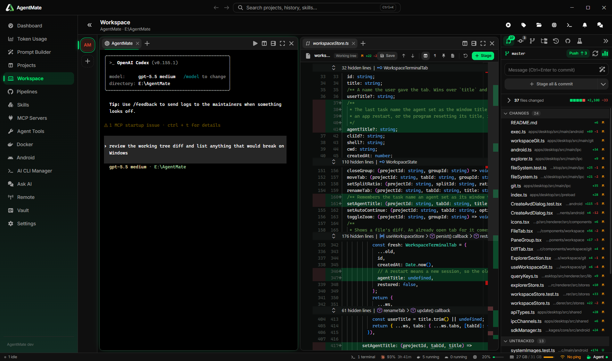
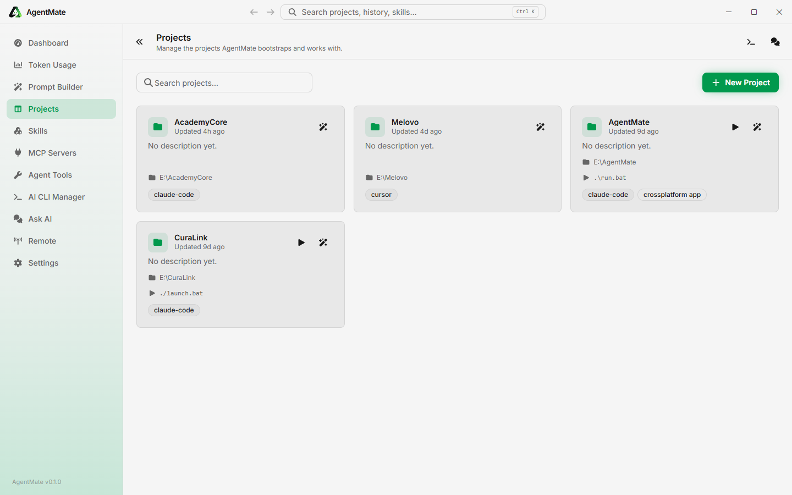
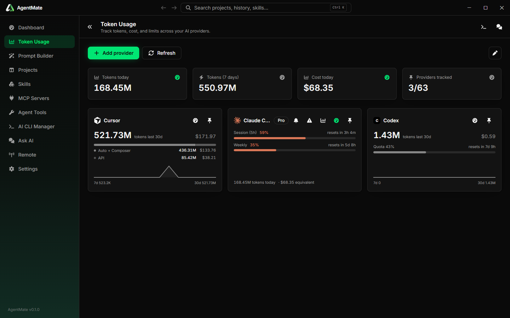
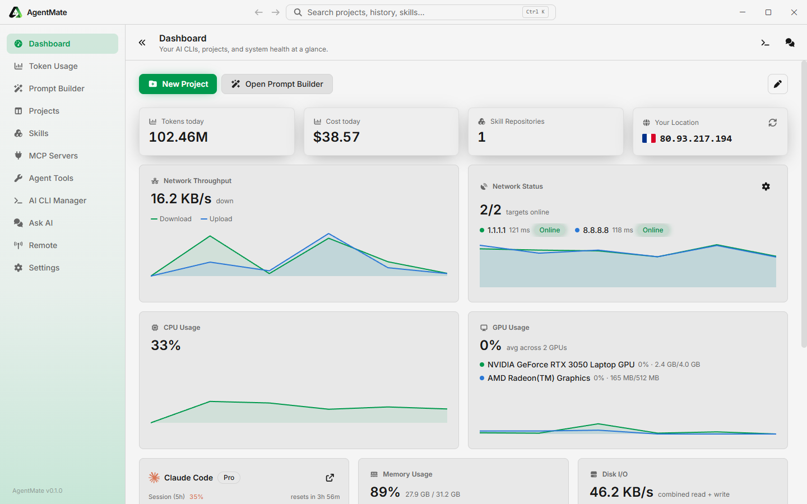
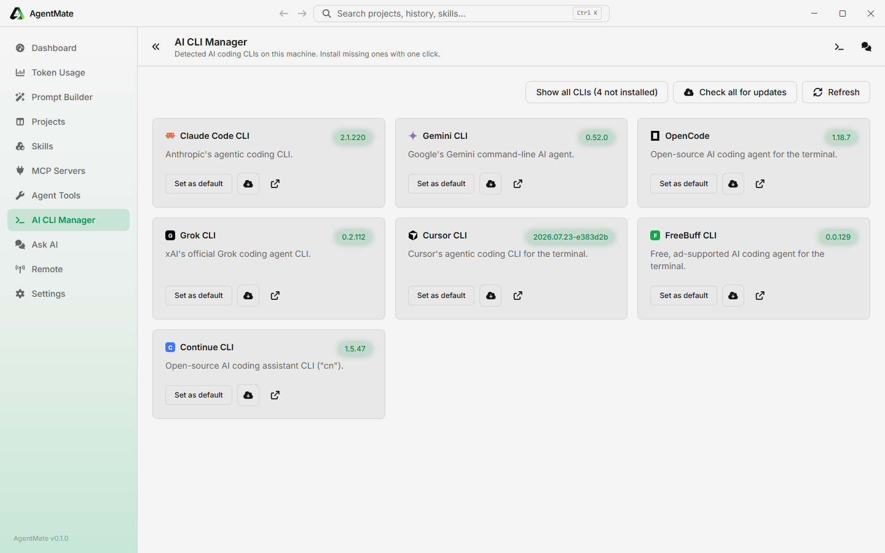
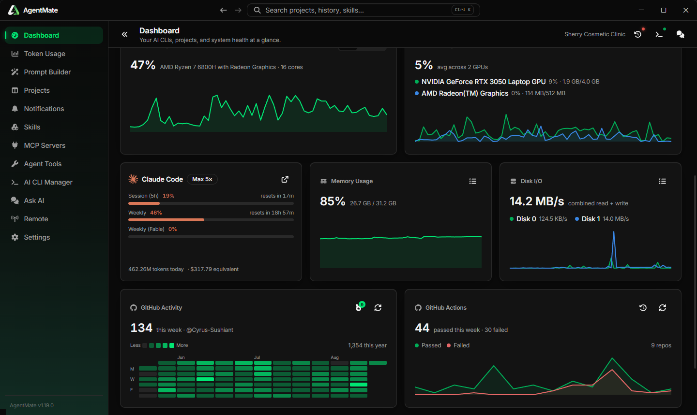
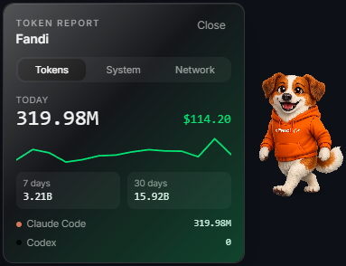

<div align="center">
  

  # AgentMate

  **An Agentic Development Environment (ADE) for AI coding agents.**

  AgentMate is where you run the work, not just where you watch it. Open a workspace, split it into panes, and put Claude Code, Codex, Cursor, Gemini, Grok, OpenCode or a plain shell in each one. The git panel, the diff viewer, the file editor, the test runner and the pipelines sit right next to the agents, so a change goes from prompt to review to commit to tag without leaving the app.

  [](https://github.com/Cyrus-Sushiant/AgentMate/actions/workflows/ci.yml)
  
  
  
  [](LICENSE)
</div>

---

## Screenshots

<table>
  <tr>
    <td colspan="2"></td>
  </tr>
  <tr>
    <td colspan="2" align="center"><em>The workspace: an agent in one pane, a diff open in the next, the git panel beside both</em></td>
  </tr>
  <tr>
    <td width="50%"></td>
    <td width="50%"></td>
  </tr>
  <tr>
    <td align="center"><em>Projects: git, reviews, packages, notes, and run commands</em></td>
    <td align="center"><em>Token Usage: tokens, cost, quotas, and desktop widgets</em></td>
  </tr>
  <tr>
    <td width="50%"></td>
    <td width="50%"></td>
  </tr>
  <tr>
    <td align="center"><em>Dashboard: CLIs, GitHub, usage, and system health</em></td>
    <td align="center"><em>AI CLI Manager: detect, install, and update coding CLIs</em></td>
  </tr>
  <tr>
    <td width="50%"></td>
    <td width="50%" align="center"></td>
  </tr>
  <tr>
    <td align="center"><em>Quotas, system health, GitHub activity, and Actions</em></td>
    <td align="center"><em>AI Pet: click the companion for a token report</em></td>
  </tr>
</table>

## Why "ADE"

An IDE is built around a person typing code. An ADE is built around agents writing it and a person steering. That changes what the app has to do:

- **Several agent sessions in view at once.** A workspace is a pane tree, not a single editor. Each pane holds a CLI or a shell with its own working directory, and AgentMate tracks what every agent is doing (working, needs input, done) so you know which pane to look at.
- **The loop has to close in one place.** Reading the diff, staging hunks, running the tests, reading the failure, sending it back to the agent, committing, tagging, watching the pipeline: all of it lives in the same window as the agent that wrote the code.
- **Agents cost money and burn quota.** Tokens, cost and rate limits are first-class, not an afterthought, and an agent tab can wait out a limit and continue on its own.
- **Agents read instructions and run commands.** So skills get scanned before an agent reads them, secrets live in an encrypted vault instead of a `.env` in the repo, and risky SSH commands stop for approval.

## Features

Six things make up the core:

- **Multi-pane workspace**: split the window into as many panes as you want and drop a CLI, a shell, a file or a diff into each. Tabs drag between panes, layouts are saved per project, and a project rail switches between the repos you have open.
- **Agent status**: every agent tab reports whether it is working, waiting on you, or finished, read from its output and from Claude Code hooks where they exist. The sidebar, the tab strip and the status bar all show it, and clicking a status jumps to that pane.
- **Git, diffs and the editor, right next to the agents**: Changes, Commits, Branches, Explorer, History, Pipelines and Tests as tabs in the side panel. Stage, unstage, discard, commit, create branches, browse the tree, and open a file or a diff as a tab in the pane (or send the file to VS Code), with Monaco for editing and hunk-level selection when you only want part of a change. When a merge, rebase or stash pop stops on conflicts, keep ours or theirs per file, let a headless AI resolve one file, or hand every conflict to an agent in a terminal with "Fix with AI".
- **Tests**: detect the test setup (Vitest, Jest, Playwright, Mocha, pytest, unittest, Go, cargo, .NET, Dart, Flutter, PHPUnit, RSpec, Gradle, Maven) and run it from the workspace. Results stream in while the run is still going, with a live elapsed clock, a filterable tree of files and cases, the raw output, and a "fix with AI" hand-off that sends the failures to an agent.
- **Review**: multi-agent code review with Diffray (bugs, security, performance, consistency) using Claude Code, Cursor Agent, OpenCode or Codex. Review the working tree, a branch, the last N commits, changed files, or the whole source tree, and save the findings as JSON.
- **Token usage and auto-continue**: track tokens, cost and rate-limit quotas across 60+ providers, with local-log scanning for Claude Code and Codex (no API key needed), combined charts, threshold alerts, and floating glass desktop widgets. Turn auto-continue on for a tab and AgentMate types `continue` for you once a usage limit resets or a network error clears, so a long run survives a window boundary or a dropped connection.

Everything else is support around that, so you don't leave the app to go and get it.

<details>
<summary><b>Everything else in the app</b></summary>

### Around the workspace

- **Prompt hand-off**: launch an agent tab and AgentMate waits for the CLI to draw a real prompt, then delivers your text as a bracketed paste. Dropped files and images paste as a short chip on the input line while the shell still gets the real quoted path.
- **Running CLIs**: one dialog lists every terminal the app owns (workspace, drawer, SSH) with live CPU and memory per process tree, plus filtering, sorting, and end or restart actions.
- **Keep awake**: a policy under Settings decides whether the machine stays awake always, only while an agent is actually producing output, or never.

### Projects

- **Project workspace**: bootstrap a repo, keep notes, pin and reorder projects, archive the ones you are done with, and launch a project's run commands from its card.
- **WordPress projects**: make a project from a connected WordPress site. AgentMate pulls the themes and plugins you pick into a folder that keeps the site's layout (`wp-content/themes/...`), so agents work on them like any other code. Review and deploy shows every file that will go, any conflicts with changes made on the site, and what stays behind: agent settings, skills and AgentMate's own files never leave your computer.
- **Git and releases**: status, branches, tags, and branch history with the tags on each commit. Bump the version in your files with a headless CLI run, review the bump file by file (or hunk by hunk), then commit, tag and push from the app. AgentMate warns before you tag a version you never bumped, and monorepo workspaces get scoped tag prefixes.
- **Security**: scan the project with Semgrep, Trivy, Bearer, SonarQube, CodeQL or Strix. See [Project security scanning](#project-security-scanning).
- **Packages**: see and update dependencies for npm, pnpm, Yarn, NuGet and Dart/Flutter pub, with an outdated-only view.
- **Environments**: keep development, test, staging, production and custom environments per project, each with its own env files and credentials, encrypted on this machine behind the vault's master password. Import existing `.env` files, copy values out when you need them, and keep the whole thing out of the repo.
- **Docker**: a Docker tab per project and a Docker page for the machine, grouped by compose project. Start, stop, restart, remove, bulk-stop, and jump to a container from the status bar.
- **Setup**: attach skills, MCP servers and hooks, edit the agent config files, and schedule prompts.

### Prompts and writing

- **Blueprint**: a stepped builder on every project that turns an idea into a Product Manager prompt. Fill in the idea, the architecture, the backend, the frontend, CI/CD, and quality one step at a time, pull in reusable snippets you defined once in Settings, and write each step as markdown with a live preview. Drop a screenshot, a recording, or a PDF straight into the writing and it lands where the caret is, so a description can sit above it and the next point below it. The last step writes a single English prompt that tells an agent to plan the project into your docs folder: phases, epics, a task backlog, milestones, and risks. Write in Persian if you like, it is translated before the prompt is generated. Every step is kept and editable, every save is a version you can read and restore, and any step you tick is mirrored into the project's CLAUDE.md or AGENTS.md.
- **Prompt Builder**: describe what you want, and AgentMate structures it into a prompt for the agent of your choice. Generate, translate and copy from the keyboard, dictate with local Whisper speech-to-text instead of typing, and get a model and reasoning-effort recommendation for the run before you start it.
- **Prompt History**: every prompt you have generated or translated, searchable, with tags and proper Persian / RTL rendering.
- **Writing check**: grammar, spelling, and style checking in the app's text boxes, powered by LanguageTool. Issues are underlined as you type, right-click one for its fix (or to check the text on the spot), and the counter in the corner opens the full list with one-click fixes. Uses LanguageTool's public API by default; drop the LanguageTool download into the app's tools folder and AgentMate runs the server itself, so nothing you write leaves the machine.
- **Ask AI**: a persistent assistant conversation, one keystroke away.

### Agents, skills, and tools

- **AI CLI Manager**: detects every AI coding CLI on the machine and installs or updates the missing ones with one click (Claude Code, Gemini, OpenCode, OpenClaude, Codex, Grok, Cursor, GitHub Copilot CLI, FreeBuff, Qwen, Aider, Goose, Cline, Continue, Pi).
- **CLI arguments and launch defaults**: save the flags, model and reasoning effort each CLI should launch with. The background calls AgentMate makes for you (commit messages, branch names, tag suggestions, version bumps, run sizing, skill deep reviews) build their command line the same way, so they use the model you picked.
- **Skill Marketplace**: install agent skills from configurable repositories or skills.sh, including into a project's agent folders, with favorites, usage tracking, and update detection.
- **Skill Security**: check what a skill actually does before you let an agent read it. A static scan over 14 risk categories, an optional deep review by an installed agent CLI, and a saved history of every check. See [Skill security](#skill-security).
- **MCP Marketplace**: install MCP servers into a project from configurable repositories.
- **Agent Tools**: curated third-party tools that cut agent token spend or improve code quality, including Diffray, the security scanners, and LanguageTool for offline writing checks.

### Machine and remote

- **Dashboard**: CLIs, usage, GitHub activity, GitHub Actions, and system health (CPU per core, GPU, memory, network) at a glance. Rearrange the cards, run a speed test, and see which apps are using the most resources.
- **Status bar**: agent statuses, cloud limits, Docker containers, CPU and memory, and the keep-awake state, each an interactive popover that takes you to the thing it is about.
- **Pipelines**: a page for GitHub Actions across the repos you connected. Run and stop workflows by hand, read run annotations without leaving the app, and hand a failed run to an agent with "Fix with AI".
- **Notifications**: GitHub Actions failures, background CLI activity, and tool updates, folded into one recent-messages list, with optional Telegram delivery.
- **Vault**: passwords, API keys, and private notes, encrypted on this computer behind a master password. Ranked search, type tabs, tags and favorites, a password generator, custom fields, CSV import with column matching and duplicate handling, export behind the master password, auto-lock, clipboard clearing on a countdown, and locking with the computer. The same vault backs the SSH, RDP, and environment credentials, and every decrypted value leaves the app's cache the moment it locks.
- **Remote**: control another AgentMate over your local network, AnyDesk-style, over WebSockets, including from the companion mobile app, with a remote file manager and resumable transfers.
- **SSH**: saved servers in the vault, terminal sessions in the drawer, and an AI task runner that prompts an agent in a RUN / FINISHED / NEEDS_INPUT loop, executes the commands in the live session, and stops for your approval on anything risky.
- **RDP**: saved Remote Desktop servers and full sessions in their own window, built on Devolutions Iron Remote Desktop.
- **Deploy**: a server panel for your own Linux servers, from install to apps, containers, websites, certificates, the firewall and an AI that can look at logs. See [Deploy](#deploy).

### The rest

- **AI Pet**: an optional desktop companion. Click it for a token report, double-click to bring AgentMate to the front, drag it around, and let it tell you when a pipeline fails, the network drops, an agent changes status, or a project finishes. Right-click for a menu (open the app, stop it wandering, snooze it for 15 minutes to 3 hours, or send it away), and it reappears on its own when the snooze ends. Built-in characters, custom nicknames, or add your own GIF / PNG / WebP.
- **Settings**: tabbed General, Agents, Shortcuts, AI Pet, AI, Notifications, Network, Vault, and Data. Five themes including VS Code Dark and VS 2026, rebindable global and workspace shortcuts, backup and restore, and updates from GitHub Releases. Update downloads run in chunks and can be paused and resumed, so a dropped connection doesn't cost you the bytes you already have.
- **Proxy**: one setting under Settings > Network decides how the whole app reaches the internet: straight out, through this machine's own proxy (PAC scripts included), or through an HTTP, HTTPS, or SOCKS server you type in, with a username and password if it wants one. It covers the AI providers, the skill and package registries, Telegram, update checks, and the CLIs and git commands AgentMate runs for you. Test connection checks a server before you save it and reports the address the internet saw you from.
- **Also in the app**: a command palette (Ctrl+K / Cmd+K), a tabbed terminal drawer (Ctrl+backtick), and a searchable history of toasts.

</details>

## Skill security

A skill is instructions an agent reads and acts on, so its text is as powerful as code, and most skills are installed from a repo you have never read. AgentMate can check one before you trust it.

**Where you can run a check**

- The shield button on any skill card: the Directory and Featured lists, the repositories you configured, and the skills you have already installed.
- **Skills → Security**, where "Check any skill" takes a folder path or a GitHub URL, lists the skills it finds there, and checks one or all of them. Nothing has to be installed or added to AgentMate first.
- A project's page, which also lists skills sitting in the project's agent folders that AgentMate did not install, so a skill someone else dropped in still gets checked.

Batch runs report progress per skill and stay out of the way while they work, so you can keep using the app.

**What the static scan looks for**

| Category | What it means |
|---|---|
| Prompt injection | Text that tries to override the agent's own instructions or hide what it does |
| Data exfiltration | Sending your files, output, or environment to an outside endpoint |
| Credential theft | Reading keys, tokens, cookies, or wallet files that belong to you |
| Privilege escalation | Asking for admin rights, editing shell profiles, or installing services |
| Supply chain | Pulling packages from unpinned, private, or non-standard sources |
| Remote code execution | Downloading something and running it, or evaluating fetched text as code |
| Anti-refusal | Jailbreak framing that pushes the agent past its own safety rules |
| System prompt leakage | Asking the agent to reveal its system prompt, tools, or hidden context |
| Memory poisoning | Writing lasting instructions into memory files, rules files, or agent settings |
| Unsafe output handling | Rendering or executing model output without escaping or review |
| Dark-pattern payment funnel | Upsells, urgency, or payment details pushed through the agent |
| Hidden content | Invisible characters or encoded blobs carrying instructions you cannot read |
| Destructive actions | Commands that delete, reset, or overwrite data without a way back |
| Overbroad permissions | Skipping approval prompts or claiming wildcard tool access |

The rules match on intent rather than on single keywords, since a deployment skill will legitimately mention `curl`. False positives still happen, which is why every finding carries its file, line number, and the offending line: the report is there to be read, not to be obeyed.

**Verdict and score**

Findings become a 0-100 score and one of four verdicts: safe, caution, risky, or dangerous. Each rule is charged once no matter how many lines it matched, so a repetitive skill isn't punished twice for the same habit, and a single critical finding keeps the verdict off the reassuring end of the scale whatever else the file looks like.

**Deep review (optional)**

Turn it on and the skill's files also go to an installed agent CLI, either the default from Settings or one you pick, for a second opinion in plain language. The rules always decide the score on their own. A review can add findings and pull the verdict down, but it can never pull it up: a model saying "looks fine" is not a reason to discard a rule that matched a real line. It's slower than the static scan, and a batch runs the CLI once per skill.

**What gets read and kept**

A check reads up to 40 files per skill, 400 KB per file, and 2 MB in total, so a skill that ships a large binary or a vendored tree still finishes. The static scan runs entirely on your machine, and a deep review goes out only through a CLI you already have installed, which talks to its own provider the way it always does. Every check is stored in a local SQLite database, shows up under **Skills → Security** with its verdict, source, and findings, is included in backups, and can be cleared from that page.

## Project security scanning

Skill security checks the instructions you hand an agent. The project Security tab checks the code the agent wrote.

| Scanner | What it covers |
|---|---|
| Semgrep | Pattern-based static analysis across many languages |
| Trivy | Dependencies, container images, IaC, and secrets |
| Bearer | Data flow and privacy risks in application code |
| SonarQube | Quality and security rules against a SonarQube server |
| CodeQL | Deep semantic analysis via GitHub's query packs |
| Strix | Agentic security testing |

AgentMate checks the prerequisites before a run and walks you through whatever is missing. Every scanner's output is normalized into one report, so severity, scoring, and filtering work the same whichever one you ran. Findings are redacted before they are stored, per-scanner logs are kept with the run, and a scan keeps going in the main process if you navigate away, so a reopened tab rejoins it instead of starting over. CodeQL is downloaded, verified, and unpacked into AgentMate's own tools folder when it is not already on PATH. Any finding can be copied to an agent as a prompt.

## Deploy

Deploy turns a Linux server you can SSH into into one you can manage from AgentMate, a bit like aaPanel but without a web panel open to the internet. Pick a saved SSH server, click Install, and AgentMate puts a small service on it (the server core, a .NET 10 program under systemd). From then on the Deploy page shows that server's sections:

| Section | What you do there |
|---|---|
| Overview | Live CPU, memory, disk and network, a health score, alerts, package updates and reboots |
| Apps | Deploy a project's compose file with its environment, follow each deploy step by step, roll back to an earlier revision, and sign in to private registries (GitHub Packages, Docker Hub, your own) |
| Containers | Docker's containers, images, volumes and networks, with live stats, logs and a console. Docker itself installs from here |
| App Store | Eighteen ready-made apps (databases, WordPress, monitoring and more), pinned by image digest, installed from one sheet |
| Websites | nginx sites and TCP or UDP proxies in front of your apps, checked with `nginx -t` before they go live, and Let's Encrypt certificates that renew themselves |
| Firewall | ufw or firewalld rules, a list of containers that publish ports past the firewall with a "make private" fix, and a change that rolls itself back unless you confirm it |
| Logs | A problems feed (crash loops, failed deploys, expiring certificates, exposed ports), any log on the server, and the Deploy AI drawer to diagnose a problem |
| Security | A checklist with a score and previewed fixes, users and roles, devices and sessions, the audit trail, encrypted backups, and the connection (SSH or direct TLS) |

Cloudflare has its own page: connect an account with a scoped API token, manage DNS records, zone settings and WAF rules, issue Origin CA certificates for a server, and lock a server's web ports to Cloudflare's addresses.

**WordPress sites without SSH or FTP**

Many WordPress sites live on hosting where there is no way in but wp-admin. For those, install the AgentMate Connector plugin (Deploy, Connect a WordPress site, Download the plugin; it is also attached to every GitHub release), make a connection key in Tools, AgentMate Connector, and paste it into AgentMate. The site then shows up in Deploy next to your servers, with its themes and plugins, its deploy history and its audit log.

- **Keys are one-time and scoped.** A key works once, for 15 minutes, and is read-only or read-write as the site's admin chose. The admin can see and revoke every connection in wp-admin, or switch everything off with `DISALLOW_FILE_MODS`.
- **Every call is signed.** Each request is signed with a key that only this computer holds (sealed like your SSH passwords), checked for freshness and replay, and every reply is signed by the site. Plain HTTP is refused unless you allow it for that site.
- **A deploy never leaves the site down.** Changes are staged where the web server cannot run them, PHP files are syntax checked, every file is snapshotted, and a health check runs afterwards. If the site breaks, even badly enough to stop answering, it puts the old files back on its own.
- **Only theme, plugin and mu-plugin files move.** Uploads, the database, WordPress core and `wp-config.php` are never touched, and nothing is ever activated.

**Security model, in short**

- **No open port.** The core listens on a Unix socket only reachable by root and its own group. The app reaches it through your SSH connection, so the server's attack surface does not grow. Direct TLS (with a client certificate per computer) is an opt-in for later.
- **Every computer is enrolled.** Each AgentMate install has its own device key, sealed on the computer. Signing in takes that key's signature plus the account password, and two-factor codes if they are on. Access tokens last 15 minutes and there is no refresh secret to steal.
- **Roles and an audit trail.** Owner, Admin, Operator and Viewer, checked by the core on every request and hub call. Sensitive actions ask for the password again, and every change lands in an audit trail that is chained so edits show.
- **Changes you can take back.** Firewall and SSH changes are previewed, then rolled back by a systemd timer unless you confirm them over a fresh SSH connection, so a mistake does not lock you out.
- **The AI cannot run anything risky on its own.** The Deploy AI may run a short list of read-only checks unattended. Anything else needs your approval, signed with this computer's key over the exact command, and the core refuses commands without one. Logs reach the model as untrusted data, with secrets taken out.
- **Secrets stay where they belong.** Registry tokens travel per deploy into a memory-only folder that is wiped afterwards, compose environment values never leave the server in API answers, and the Cloudflare account token stays on your computer (a server only gets a token scoped to one zone, and only if you ask for DNS checks).

**Supported servers**

Ubuntu 22.04, 24.04 and 26.04, Debian 12 and 13, and RHEL, Rocky, AlmaLinux and CentOS Stream 9 and 10, on x64 or arm64, with systemd. The test servers cover Ubuntu 24.04, Debian 13 and Rocky 9, with ufw and firewalld variants (see `apps/server-core/test-servers`).

**Try it without a server**

The DevHost is the real core on `127.0.0.1` with a pretend machine behind it (moving metrics, Docker with a few projects, nginx, a firewall, updates). It needs the .NET 10 SDK and works on Windows and macOS too:

```bash
# Terminal 1: start the DevHost on port 7810
dotnet run --project apps/server-core/src/AgentMate.ServerCore.DevHost

# Terminal 2: start the app pointed at it (development builds only)
AGENTMATE_DEPLOY_DEV_CORE=7810 pnpm dev
```

Open Deploy, pick DevHost, and sign in with its development password, `agentmate-local-password`. Packaged builds ignore `AGENTMATE_DEPLOY_DEV_CORE`.

The delivery plan, each epic's notes and what is still unverified are in [`docs/`](docs/DELIVERY_STATUS.md).

## Tech stack

| Layer | Stack |
|---|---|
| Desktop app | Electron, React 19, TypeScript 7, Vite (`electron-vite`), Tailwind CSS, Radix UI, TanStack Query, Zustand |
| Editor and terminal | Monaco, xterm.js, node-pty |
| Mobile companion | Expo / React Native, WebRTC |
| Shared packages | `@agentmat/core` (business logic), `@agentmat/protocol` (shared types/wire protocol) |
| Local storage | better-sqlite3, plus an encrypted vault file for secrets |
| Remote | `ws` for the local-network protocol, `ssh2` for SSH, Devolutions Iron Remote Desktop for RDP |
| Speech | `@huggingface/transformers` running Whisper locally |
| Updates | electron-updater (GitHub Releases) |
| Server core | .NET 10, ASP.NET Core, SignalR over a Unix socket, xUnit v3; Tapper and TypedSignalR.Client.TypeScript generate the desktop's typed client |
| Tooling | pnpm workspaces, Biome |

## Project structure

```
AgentMate/
├── apps/
│   ├── desktop/     Electron app (main, preload, renderer), the primary product
│   ├── mobile/      Expo/React Native companion app for the Remote feature
│   └── server-core/ .NET 10 service the Deploy section installs on your servers
├── docs/            Delivery plan for the Deploy section (roadmap, epics, status)
├── packages/
│   ├── core/        Shared business logic (@agentmat/core)
│   └── protocol/    Shared types and wire protocol (@agentmat/protocol)
└── patches/         pnpm patches for third-party packages
```

The Deploy section spans three places:

```
apps/server-core/
├── src/AgentMate.ServerCore/          The server core: REST and SignalR API, identity, Docker, compose,
│                                      nginx, ACME, firewall, security checklist, backups, exec for the AI
├── src/AgentMate.ServerCore.DevHost/  The core on loopback with a pretend machine, for development and e2e
├── tests/                             xUnit v3: the core in memory, and system tests that need Linux
├── test-servers/                      Dockerfiles for systemd test servers (Ubuntu, Debian, Rocky, ufw,
│                                      firewalld) and the nginx harness
└── packaging/                         The systemd unit
apps/desktop/src/main/deploy/          SSH tunnel and install, the live hub link, IPC, and the system tests
                                       (`*.int.test.ts`) that install on the test servers
apps/desktop/src/renderer/src/components/deploy/   The Deploy screens, one folder per section
```

`apps/server-core` is a .NET solution rather than a pnpm package, so it has no `package.json`; the root `server-core:*` scripts drive it. Its C# contracts are the source of truth for the desktop's typed client: `pnpm server-core:contracts` regenerates `apps/desktop/src/shared/deploy/protocol/generated` with Tapper and TypedSignalR.Client.TypeScript, and CI fails when the committed TypeScript is out of date.

`packages/core` holds the logic that does not need Electron, grouped by feature: `blueprint`, `cli`, `env`, `git`, `grammar`, `mcp`, `models`, `network`, `projectBootstrap`, `promptBuilder`, `security`, `skills`, `system`, `testing`, `tools`, `usage`, `vault`, and `workspace`.

## Getting started

**Prerequisites:** Node.js ≥ 20, [pnpm](https://pnpm.io) ≥ 11. Working on `apps/server-core` also needs the [.NET 10 SDK](https://dotnet.microsoft.com/download/dotnet/10.0) (the feature band pinned in `apps/server-core/global.json`).

Installers for Windows, macOS, and Linux are published on [GitHub Releases](https://github.com/Cyrus-Sushiant/AgentMate/releases). The app can also check that feed and install an update from Settings.

```bash
pnpm install

# Build the shared packages and launch the desktop app in dev mode
pnpm dev
```

On Windows you can also just run `run.bat`, which installs dependencies, verifies the Electron binary, and starts the app.

### Common scripts (from the repo root)

| Command | What it does |
|---|---|
| `pnpm dev` | Build `core`/`protocol`, then launch the desktop app in dev mode with hot reload |
| `pnpm build` | Build `core`, `protocol`, and the desktop app's production bundle |
| `pnpm package` | Package the desktop app into installers via `electron-builder` |
| `pnpm mobile` | Build `protocol`, then launch the Expo dev server for the mobile companion app |
| `pnpm typecheck` | Type-check every workspace package |
| `pnpm lint` | Lint every workspace package |
| `pnpm check` | Run Biome over the whole repo (format, lint, import order) |
| `pnpm check:fix` | Same as `pnpm check`, but writes the safe fixes |
| `pnpm check:deprecated-code` | Fail on imports upstream has marked `@deprecated` |
| `pnpm check:deprecated-deps` | Fail on direct dependencies npm reports as deprecated |
| `pnpm test` | Run every package's test suite |
| `pnpm test:unit` | Unit, integration and component tests (core, protocol, desktop) |
| `pnpm test:coverage` | The same with coverage, then print a summary table |
| `pnpm test:mobile` | The mobile app's Jest suite |
| `pnpm test:e2e` | Build the desktop app and drive it end to end through Playwright |
| `pnpm server-core:build` | Build the .NET server core solution |
| `pnpm server-core:test` | The server core's unit and integration tests (xUnit v3) |
| `pnpm server-core:format` | Format the server core with `dotnet format` (`server-core:format:check` only verifies) |
| `pnpm server-core:contracts` | Regenerate the desktop's TypeScript contracts from the server core's C# ones |

### Testing

Tests live next to the code they cover (`foo.ts` has `foo.test.ts` beside it). End-to-end specs are the exception: they live in `apps/desktop/e2e/*.e2e.ts`.

| Layer | Where | Runner |
|---|---|---|
| Unit | `packages/core`, `packages/protocol`, pure modules in `apps/desktop` | Vitest (node) |
| Integration | `apps/desktop/src/main/**`, IPC handlers, stores and hooks | Vitest (node and jsdom) |
| Component | `apps/desktop/src/renderer/**` | Vitest (jsdom) plus Testing Library |
| End to end | `apps/desktop/e2e` | Playwright, driving the built Electron app |
| Mobile | `apps/mobile` | Jest (`jest-expo`) plus React Native Testing Library |
| Server core | `apps/server-core/tests/AgentMate.ServerCore.Tests` | xUnit v3 on Microsoft.Testing.Platform, with the real web host in memory |
| Server core system | `apps/server-core/tests/AgentMate.ServerCore.SystemTests` | xUnit v3, Linux with Docker only (the nightly workflow) |
| Deploy system | `apps/desktop/src/main/deploy/*.int.test.ts` | Vitest against systemd test servers in Docker, with the published core (`AGENTMATE_SYSTEM_TESTS=1`) |

The desktop suite is split into two Vitest projects, configured in `apps/desktop/vitest.config.mts`:

- **main** runs in Node with `electron` replaced by a fake (`src/test/main/electronMock.ts`) and `better-sqlite3` by a `node:sqlite` wrapper (`src/test/main/sqliteShim.ts`). The wrapper matters because `pnpm dev` rebuilds better-sqlite3 for Electron's ABI, after which plain Node can no longer load it. Run one project on its own with `pnpm --filter @agentmat/desktop test:main`.
- **renderer** runs in jsdom with the browser APIs Radix and the charts need, and with Monaco, Iron Remote Desktop and Framer Motion stubbed. A file that needs to replace `window` itself can opt out with a `// @vitest-environment node` first line.

Shared helpers sit in `apps/desktop/src/test/`:

- `main/ipcHarness.ts` registers an IPC module against the fake `ipcMain` and calls its channels: `useTempUserData()`, `invoke(channel, ...)`, `expectChannelsCovered(IPC.namespace)` (which fails when a registered channel has no test).
- `main/fixtures.ts` builds temp trees, real git repositories and local HTTP servers.
- `renderer/agentmatBridge.ts` fakes `window.agentmat`, the preload bridge. Answers are dotted paths (`{ 'projects.list': [project] }`), unconfigured calls resolve to undefined, and events are fired with `bridge.$emit('agents.onStatus', payload)`.
- `renderer/renderWithProviders.tsx` renders with the query client, tooltips and router that `App.tsx` provides.

End-to-end runs build the app into `out-e2e/` so a running `electron-vite dev` keeps `out/`. Each test gets its own profile through `AGENTMATE_USER_DATA_DIR`, and `AGENTMATE_E2E=1` turns off the startup work that would reach outside it (the Docker scan sweep, update checks) and the quit confirmation. The main, widget, RDP and remote session windows stay hidden during a run so they don't pop up over your work; set `AGENTMATE_E2E_SHOW=1` to watch one instead. That combination is what lets the suite run while the real AgentMate is open. Set `AGENTMATE_E2E_SKIP_BUILD=1` to reuse the last build while iterating, and `AGENTMATE_E2E_NO_SANDBOX=1` where Chromium's sandbox is unavailable. Failures leave a trace in `apps/desktop/test-results`, viewable with `pnpm --filter @agentmat/desktop exec playwright show-trace <path>`.

Tests need Node 22.13 or newer, because the SQLite stand-in uses `node:sqlite`.

The Deploy system tests boot whole Linux machines, so they only run when asked. They need Docker with Linux containers and a published core: run `pnpm server-core:publish linux-x64`, then `AGENTMATE_SYSTEM_TESTS=1 pnpm --filter @agentmat/desktop exec vitest run src/main/deploy/deploy.int.test.ts` (or any other `*.int.test.ts`). Each test has its default servers; `AGENTMATE_TEST_SERVER_IMAGES=debian-13` (comma separated) runs every test that supports them on those instead. The full-stack run, `e2e/deployFullStack.e2e.ts`, drives the built app through the whole Deploy story against one of these servers (install, two-factor, Docker, a stack, a private image, a site with a Pebble certificate, a firewall revert and a Deploy AI fix): `AGENTMATE_SYSTEM_TESTS=1 AGENTMATE_TEST_SERVER_IMAGES=ubuntu-24.04-ufw pnpm --filter @agentmat/desktop test:e2e deployFullStack.e2e.ts`. Ordinary e2e runs skip it.

### CI

Every push and pull request runs [`.github/workflows/ci.yml`](.github/workflows/ci.yml): Biome (formatting, lint, import order), the two deprecation gates above, a type-check of every package, a real build of the desktop app, and the test suites in [`.github/workflows/test.yml`](.github/workflows/test.yml). That reusable workflow has four jobs: unit and integration with coverage, the server core (locked restore, `dotnet format`, build, tests, and a check that the generated TypeScript contracts are current), the mobile Jest suite, and the end-to-end matrix on Linux, Windows and macOS. The E2E matrix and the Deploy system tests on the Ubuntu and Rocky test servers are the slow ones, so they run when the commit message carries `[e2e]` or when you ask for them on a manual dispatch. `All checks passed` is the single status to require in branch protection. Running `pnpm check && pnpm check:deprecated-code && pnpm check:deprecated-deps && pnpm typecheck && pnpm build && pnpm test:unit` reproduces most of it locally.

A deprecated dependency you cannot drop yet goes in [`.github/deprecated-deps-allowlist.json`](.github/deprecated-deps-allowlist.json) with a reason for keeping it.

The full server matrix runs in [`.github/workflows/nightly.yml`](.github/workflows/nightly.yml), every night and on a manual dispatch, never on a push: every Deploy system test on Ubuntu 24.04, Debian 13 and Rocky 9 and on the ufw and firewalld servers, one server per job, the full-stack e2e run on the ufw and firewalld servers, plus the server core's nginx and Pebble system tests.

Releases are built and published by [`.github/workflows/cd.yml`](.github/workflows/cd.yml) when a `v*.*.*` tag is pushed, and it runs the same test workflow first, so a failing test cannot ship.

## License

[MIT](LICENSE) © SmartClouds
